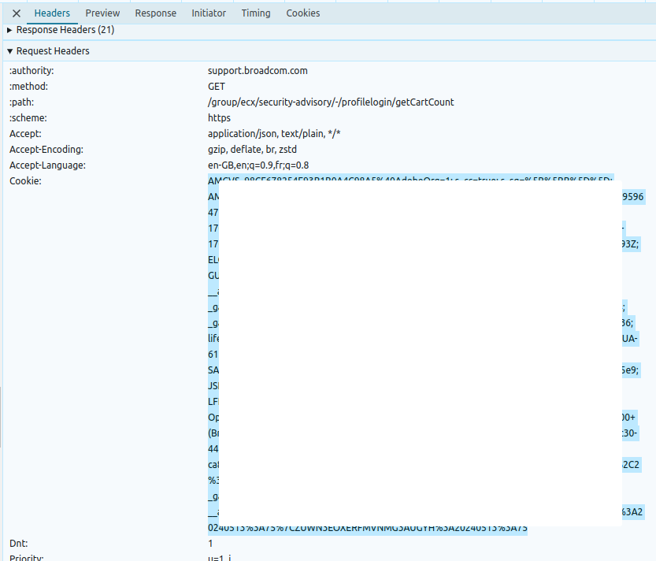

# broadcom-portal-cve-collector
CLI tool to extract CVEs from the Broadcom portal.

## Instructions

Download the executable from the [releases page](https://github.com/laidbackware/broadcom-portal-cve-collector/releases/latest).

The CLI does not take any arguments, but you must provide a session token for [support.broadcom.com](https://support.broadcom.com/) from your web browser. See [instructions](#token-collection-in-chromium-based-browsers) below.

You can either set the cookie as `BC_COOKIE` environment variable (remember to wrap in single quotes), or paste inline when running the tool.

## Token collection in Chromium based browsers

Browse to the [Security Advisories](https://support.broadcom.com/group/ecx/security-advisory) page and log in.

- Open Developer Tools. Menu > More Tools > Developer Tools
- Click the `Network` tab
  
  
- Refresh the web page and wait for it to load with the requests.
- Click on any of the requests where the name starts with `get`.

  
- Click the `Headers` tab in the pop out
- Scroll down and expand the `Request Headers` section
- Copy ALL text from the `Cookie` field for use when running the tool

  
